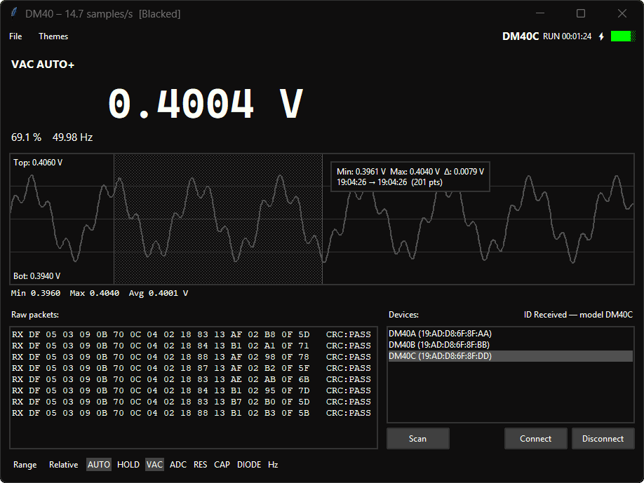
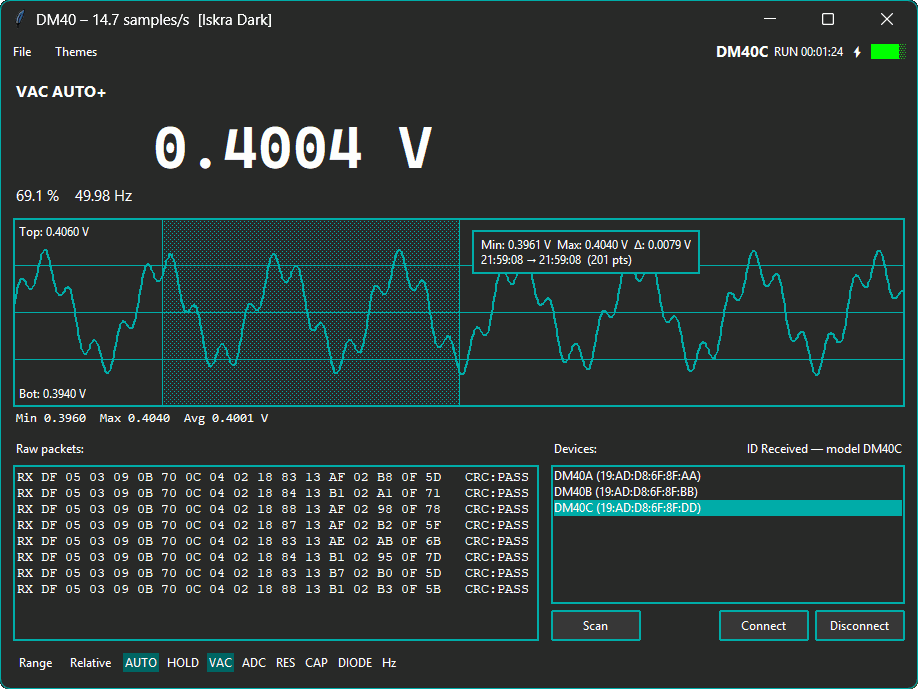

# DM40GUI

DM40GUI is a Windows desktop app for DM40-series multimeters over Bluetooth Low Energy (BLE).

- Windows only (if someone wants to maintain a non-Bleak Linux BLE stack let me know)
- Tkinter UI
- Pure Python runtime from source (no third-party runtime dependencies)


## Features

### Live Readout and Waveform

- Scrolling waveform graph with live value display
- Pause/resume updates
- CSV save and record for waveform data
- Min/Max/Avg stats strip aligned with current display scaling
- Click to pin a sample, drag to select a range — shows min/max/delta and timestamp span

<p align="center">
  
</p>

### DMM Controls

- Hold, auto-range, relative, and mode/range switching
- Status indicators (charge, screen lock and hold) are also displayed
- Almost 100% feature compatibility with atk-xtool

### Raw Packet Inspector

- Hex packet log with inline CRC pass/fail tags
- Find popup (`Ctrl+F` / `F3` / `Shift+F3`)

### Themes

- 17 built-in themes, persisted across sessions
- Theme browser with live preview

<p align="center">
  
</p>

## Requirements

Minimum: **Windows 10 version 1703** (Creators Update, build 15063).
The BLE GATT APIs used (`IBluetoothLEDevice3`, `IGattDeviceService3`) were introduced in that release.
Connection parameter tuning (`IBluetoothLEDevice6`) is available on Windows 11+ and silently skipped on older builds.

Runtime (source):

- Windows 10 1703+
- Python 3.13 with Tkinter

Release build:

- Python 3.13
- Nuitka
- MSVC Build Tools (Nuitka `--msvc=latest` target)

## Keybinds

Global app shortcuts:

| Keybind | Action |
|---|---|
| `P` | Pause/resume waveform updates |
| `R` | Start/stop waveform CSV recording |
| `Ctrl+S` | Save current waveform buffer to CSV |
| `Ctrl+C` | Copy current reading text |

Raw packet viewer shortcuts:

| Keybind | Action |
|---|---|
| `Ctrl+F` | Open find popup in raw packet panel |
| `Enter` | Next find result |
| `Shift+Enter` | Previous find result |
| `F3` | Next find result |
| `Shift+F3` | Previous find result |
| `Esc` | Close find popup / clear active focus state |

Waveform mouse actions:

| Action | Behavior |
|---|---|
| Left click on trace | Pin tooltip at a sample |
| Left-click drag | Select range and show min/max/delta |
| Right click | Clear pinned point / clear selection |

## Project Layout

| Path | Description |
|---|---|
| `main.py` | App entry point |
| `dm40/app.py` | Tk app and UI event loop integration |
| `dm40/ble_worker.py` | BLE transport worker thread |
| `dm40/parsing.py` | Packet decode to UI model |
| `dm40/protocol_constants.py` | UUIDs, command bytes, mode/range maps |
| `GUI/` | Widgets, controls, theme UI |
| `build_release.cmd` | One-file Nuitka build script |

## Protocol Notes

Reverse-engineered from BLE HCI packets with Wireshark.

### BLE Endpoints

| Direction | UUID |
|---|---|
| Notify (DMM -> PC) | `0000fff1-0000-1000-8000-00805f9b34fb` |
| Write (PC -> DMM) | `0000fff3-0000-1000-8000-00805f9b34fb` |

Defined in `dm40/protocol_constants.py`.

### Command Frames

All commands are 6 bytes:

```text
AF 05 03 <cmd> <arg> <checksum>
```

Checksum formula:

```text
(-sum(first_5_bytes)) & 0xFF
```

Built by `_build_command_packet` in `dm40/app.py`.

Known commands:

```text
CMD_ID          af 05 03 08 00 41
CMD_READ        af 05 03 09 00 40
CMD_HOLD_ON     af 05 03 04 01 01
CMD_HOLD_OFF    af 05 03 04 01 00
CMD_AUTO_ON     af 05 03 03 01 01
CMD_AUTO_OFF    af 05 03 03 01 00
CMD_RELATIVE    af 05 03 05 01 01
```

### Notifications

Two packet families:

- Model ID: prefix `DF 05 03 08 14`.
- Measurement: prefix `DF 05 03 09`, decoded by `parse_measurement_for_ui`.

### Measurement Decode

Minimum packet length: 16 bytes.

| Byte(s) | Field |
|---|---|
| `data[5]` | Mode/range flag (`FLAG_INFO`) |
| `data[6]` | Status byte |
| `data[14:16]` | Primary counts (m1, little-endian) |
| `data[12:14]` | Secondary counts (m2, little-endian) |
| `data[10:12]` | Tertiary counts (m3, little-endian) |
| `data[-8]` | Scale/sign slot 1 |
| `data[-9]` | Scale/sign slot 2 |
| `data[-10]` | Scale/sign slot 3 |

CRC check:

```text
(sum(all_bytes) & 0xFF) == 0
```

### Status Byte

`data[6]` bitfield:

| Bits | Meaning |
|---|---|
| `& 0x07` | Battery level (0-5 bars) |
| `& 0x08` | Charging |
| `& 0x40` | Screen lock |
| `& 0x80` | Hold |

## Disclaimer

This project is not affiliated with, endorsed by, or associated with Alientek or any of its subsidiaries.

## Run from Source

```powershell
py -3.13 main.py
```

No additional runtime package install is required for source execution.

## Build for Release

Install build dependency:

```powershell
py -3.13 -m pip install --upgrade nuitka
```

Run build script:

```powershell
build_release.cmd
```

The script is CI-friendly:

- deterministic compiler/linker env setup
- non-zero exit on failure
- configurable via `DM40_*` environment variables

Build environment variables:

| Variable | Purpose |
|---|---|
| `DM40_PYTHON` | Python launcher/command (default: `py -3.13`) |
| `DM40_OUT_DIR` | Build output directory |
| `DM40_CCFLAGS` | Additional compiler flags |
| `DM40_LINKFLAGS` | Additional linker flags |
| `DM40_NUITKA_FLAGS` | Additional Nuitka flags |
| `DM40_MODE_FLAGS` | Build mode flags (default: `--deployment`) |
| `DM40_CONSOLE_MODE` | Nuitka console mode (`disable`, `attach`, `force`) |
| `DM40_MSVC` | Nuitka MSVC selector (default: `latest`) |
| `DM40_JOBS` | Parallel compile jobs |
| `DM40_EMIT_MODULE_REPORTS` | Emit `modules.txt` and compilation XML report (`1` local default, `0` default when `CI` is set) |

Minimal CI example (Windows CMD shell):

```cmd
set DM40_PYTHON=py -3.13
set DM40_OUT_DIR=build\ci\nuitka
call build_release.cmd
```

## License

Licensed under [LICENSE](LICENSE).